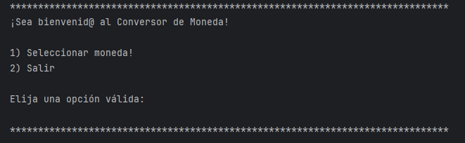

# Conversor de Moneda

¡Bienvenid@ al Conversor de Moneda! Este es un proyecto en Java que permite a los usuarios convertir entre diferentes monedas utilizando la API de ExchangeRate.

## Descripción

Este programa permite a los usuarios seleccionar una moneda de origen y una moneda de destino para realizar la conversión. Utiliza la API de ExchangeRate para obtener los tipos de cambio actualizados y calcular el monto convertido.

## Características

- Selección de moneda de origen y destino.
- Conversión entre múltiples monedas (COP, USD, EUR, ARG, JPY, MXN, KRW, GBP, CAD).
- Interfaz de línea de comandos amigable.
- Manejo de errores para entradas inválidas y fallos en la API.

## Requisitos

- Java 11 o superior.
- Dependencias de la biblioteca Gson para el manejo de JSON.

## Instalación

1. Clona el repositorio:
   ```bash
   git clone https://github.com/EdwardCCB/Conversor-de-Monedas.git

2. Navega al directorio del proyecto:
   ```bash
   cd conversor-de-moneda

3. Asegúrate de tener todas las dependencias necesarias. Puedes utilizar Maven o Gradle según la configuración de tu proyecto.


4. Compila el proyecto:
   ```bash
   javac src/com/aluracursos/conversordemonedas/main/Principal.java

## Uso

Para ejecutar el conversor de moneda, utiliza el siguiente comando:
   ```bash
   java -cp src com.aluracursos.conversordemonedas.main.Principal
   ```
Sigue las instrucciones en pantalla para seleccionar las monedas y realizar la conversión.

## Ejemplo de Uso



El programa presentará los menús para seleccionar las monedas y realizar las conversiones.

## Contribuciones

Las contribuciones son bienvenidas. Si tienes alguna idea o mejora, no dudes en hacer un fork del repositorio y enviar un pull request.

## Licencia

Este proyecto está bajo la Licencia MIT. Consulta el archivo [LICENSE](LICENSE) para más detalles.

## Autor

- Mauro Trillos
- GitHub [@EdwardCCB](https://github.com/edwardccb)